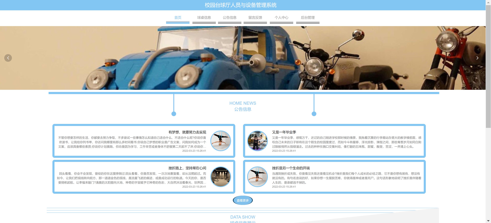
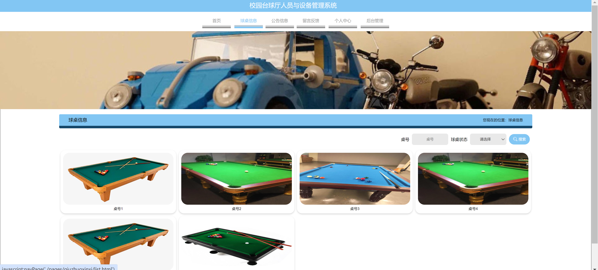
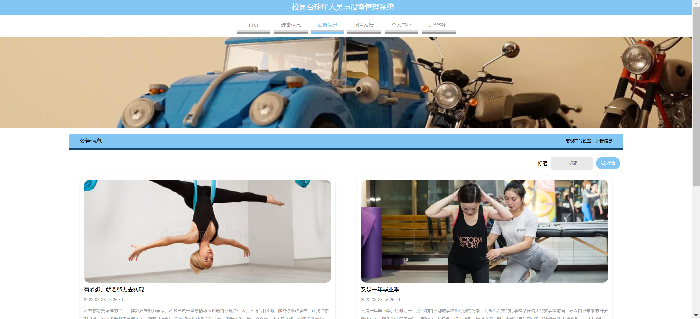
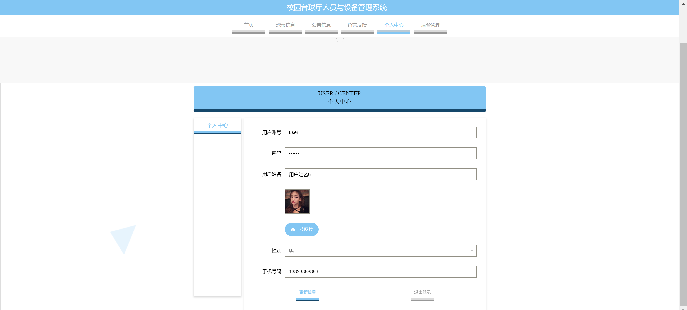
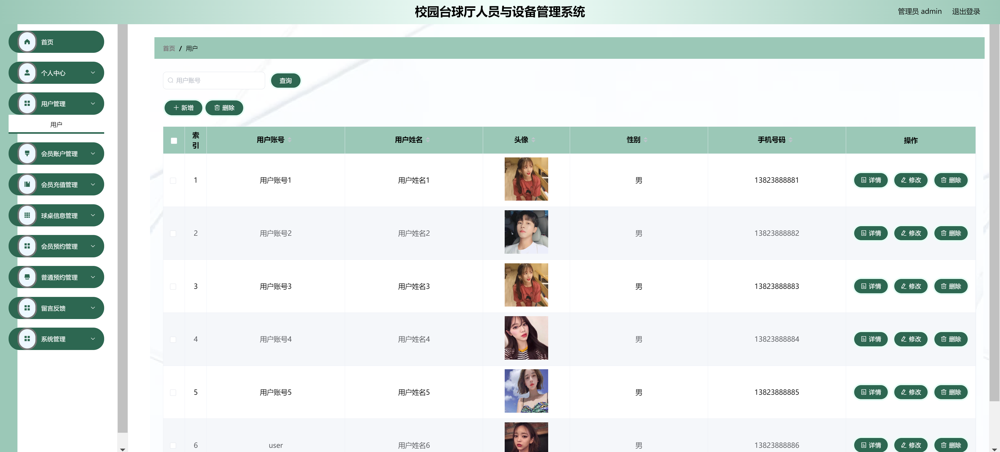
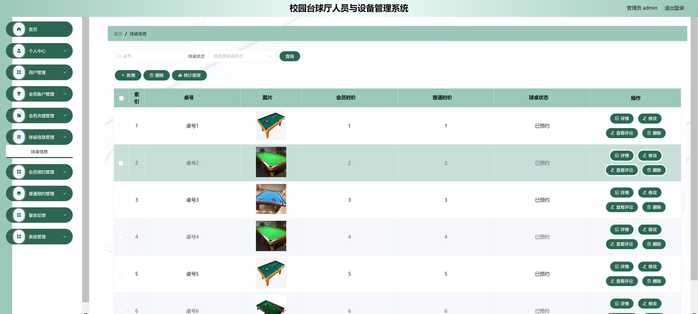
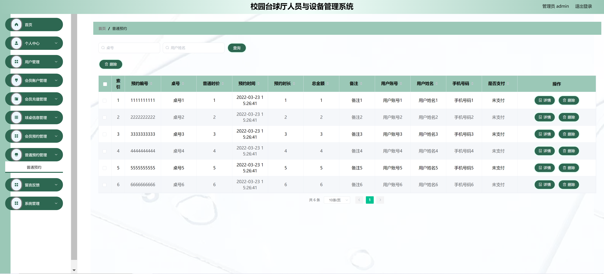
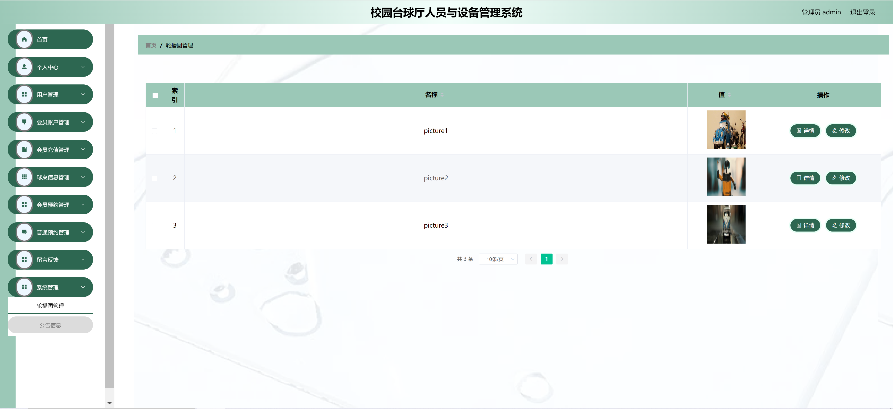

<h1 align="center">校园台球厅设备管理系统1</h1>

## 简介
校园台球厅设备管理系统：角色分为管理员、用户；支持设备管理、用户信息管理、预约管理、公告发布，提供简洁直观的界面以提升管理效率。    --计算机毕业设计源码；毕设源码；java毕业设计源码

## 联系方式

<h3 align="center">获取完整代码与数据库文件 + 微信：bysj5151 QQ: 86050149 QQ群: 783742310</h3>

<h3 align="center">可帮忙远程部署 包运行成功！提供远程部署、修改代码、设计文档指导、代码讲解等服务！</h3>

## 功能介绍（完整见运行截图）
管理员： 基本功能包括登录与退出。系统主要提供设备的添加、删除、修改、查询功能，以及用户与会员账户管理、预约与留言管理、公告信息发布等。此外，管理员可以通过后台管理模块查看与管理台球桌的状态和设备使用记录，并维护系统中的用户权限与个人信息。

用户： 用户通过登录界面进入系统，可以在个人中心更新账号、密码、姓名、性别、手机号等个人信息。用户还可以浏览公告信息，留言反馈，并通过系统进行台球桌预约，查看预约记录。同时，用户有权限查看设备的使用状态和台球桌的具体信息。

## 运行截图

本代码来源于网络,仅供学习参考使用!

